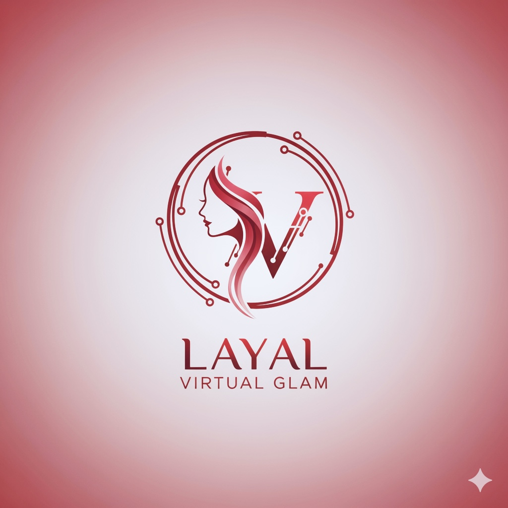

<!-- 🌹 HEADER WITH LOGO + ANIMATED TITLE -->

  

  

  

---

### Project Overview
**Layal Virtual Glam Shop** showcases professional backend design with a refined aesthetic.  
It pairs a **curated makeup catalog** and elegant REST APIs with an **in-memory H2 database**.

<td align="right" width="50%">

</td>
</tr>
</table>

---

- Product catalog (skincare, foundation, blush, etc.)  
- Order API endpoints (create/view demo order)  
- Auto-loading H2 sample data  
- Clean architecture → Controller → Service → Repository  
- Deployed live on **Railway Cloud**

---

<!-- Live Demo button (clickable) -->

  

---

  
  
  
  

  

